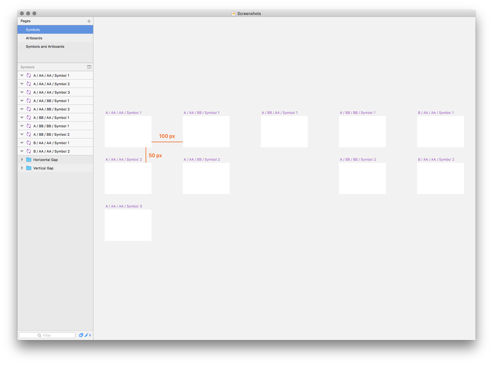
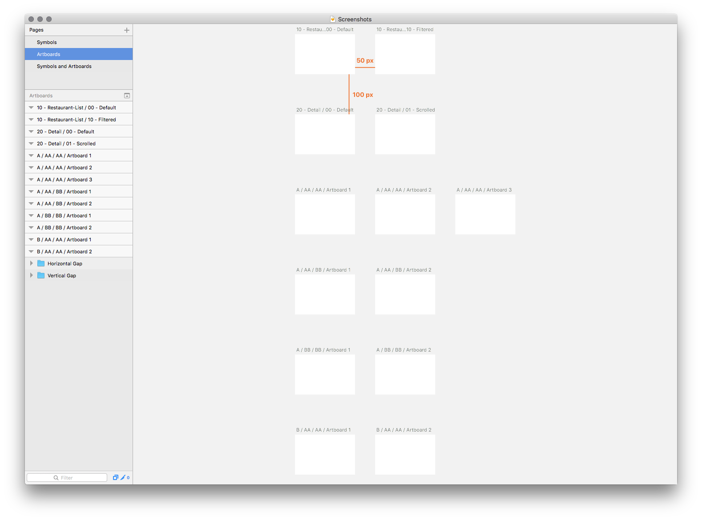
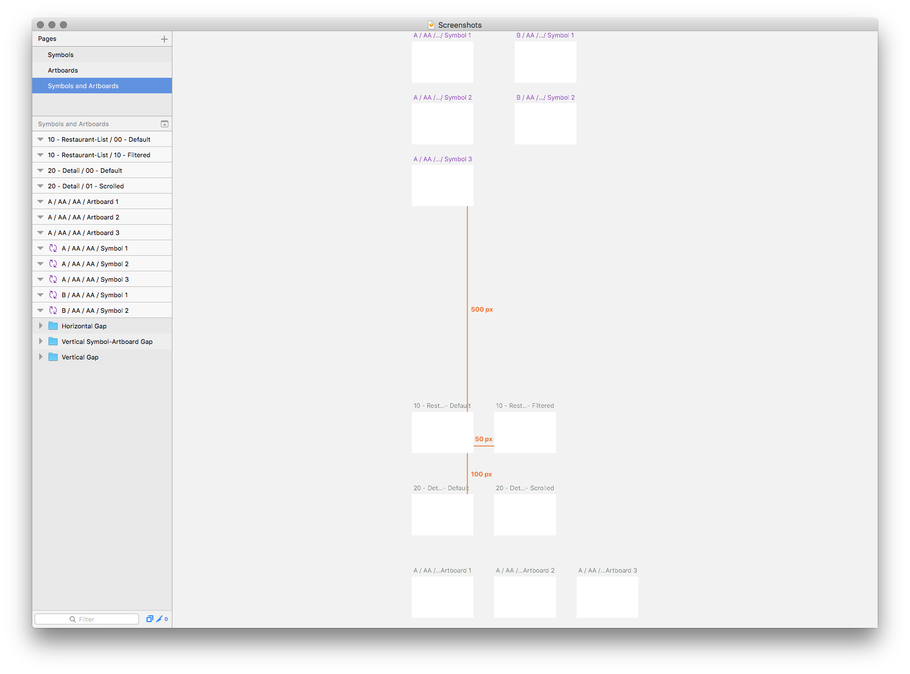

# symbol-and-artboard-organizer

Rearranges symbols and artboards on a selected page.

## What is does

- Sorts symbols and artboards in the layer list to be grouped together and reorders them by name or identifier (ascending)
- Rearranges symbols in a column-based layout, grouped together by name
- Rearranges artboards in a row-based layout, grouped together by name or identifier

## What is doesn’t do

- Lets you configure the plugin in any way

## What is an identifier

If your artboard names (or each segment seperated by a slash) start with a two-figure number, the concatenated number will be used for sorting and grouping

### Example

- `10 - Restaurant-List / 00 - Default` has an identifier of **1000**
- `10 - Restaurant-List / 10 - Filtered` has an identifier of **1010**
- `20 - Detail / 00 - Default` has an identifier of **2000**
- `20 - Detail / 01 - Scrolled` has an identifier of **2001**

## Screenshots
### Organize a page containing only symbols

### Organize a page containing only artboards

### Organize a page containing both symbols and artboards

